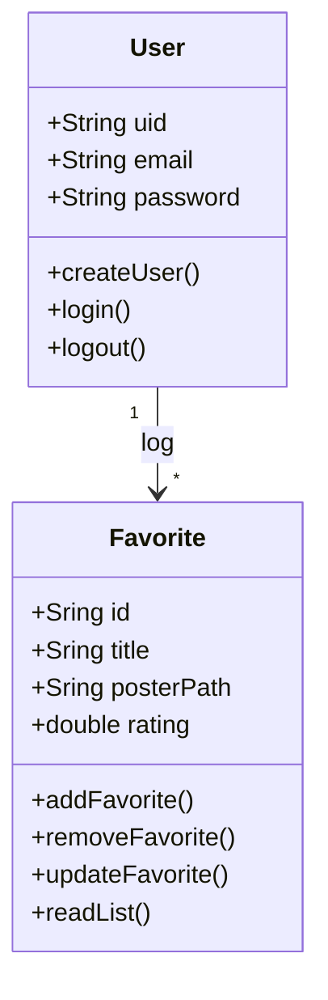
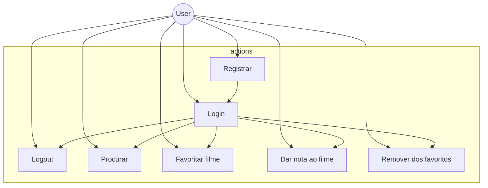
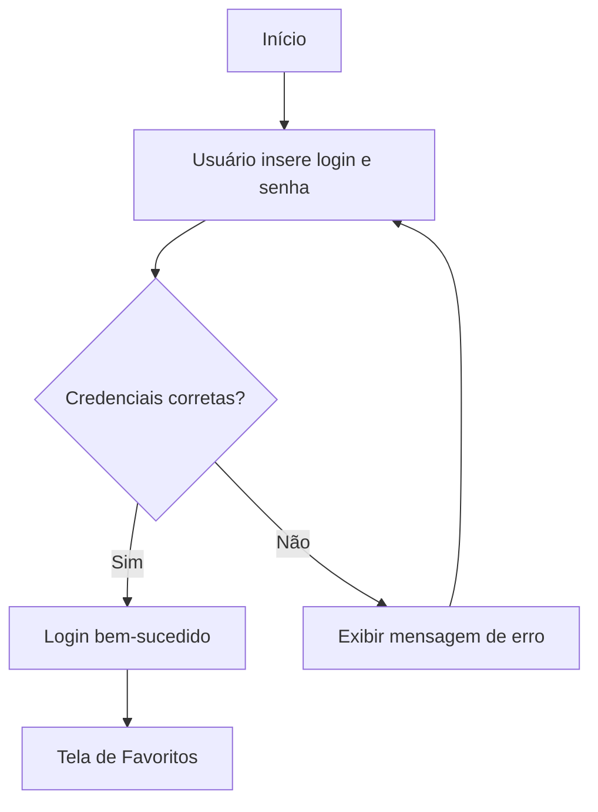

# CineFavorite - Formativa
Construir um Aplicativo do Zero - O CineFavorite permitirá criar uma conta e buscar filmes em uma API e montar uma galeria pessoa de filmes favoritos, com posters e notas.

## Objetivos
- Criar uma galeria personalizada por usuário de filmes favoritos;
- Fazer conexão com uma API (base de dados) de filmes;
- Permitir a criação de contas para cada usuário;
- Listagem de filmes por palavra-chave.

## Levantamento de Requisitos do Projeto
    ### - Funcionais
    ### - Não Funcionais

## Recursos do Projeto
- Flutter / Dart
- Firebase ( Authentication / FireStore Database )
- API TMDB
- Figma
- VsCode

## Diagramas
    ### 1. Classes
    Demonstrar o funcionamento das entidades do sistema
    - User :  classe já modela pelo FirebaseAuth
        - email
        - senha
        - uid

        - login()
        - logout()
        - create()

    - Favorito :  classe modelada pelo desenvolvedor
        - number: id
        - string: titulo
        - string: poster
        - double: rating

        - adicionar()
        - remover()
        - listar()
        - atualizar()

    ### 2. Uso
    Ações dos atores:
    - User:
        - Registrar
        - Login
        - Logout
        - Procurar
        - Salvar filmes
        - Dar nota aos filmes
        - Remover dos favoritos

    ### 3. Fluxo
    Determina o caminho percorrido pelo ator para executar uma ação.
    - Ação de Login

## Prototipagem

## Codificação